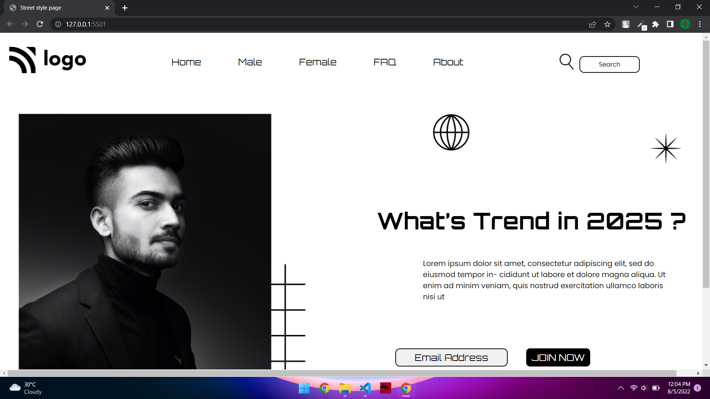

# Project 1 - Street Style landing Page

## Hi there, I am `Akshay Barapatre` Aspiring FullStack Javascript Developer and here is my project  

---

## Short View of Website

---

 
## Project 1 [Live Link](https://street-landing-page.netlify.app/)

-   Skills Gained in this project
    -   Learned how to solve issue in CSS
    -   Learned to set Images  
    -   Learned various flexbox properties.
    -   Learned about positioning properties
     

---

## Time taken to finish this project

-   I took 8 Hour to Complete this project

